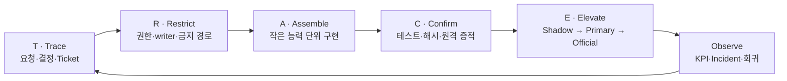

# TRACE Gate Framework

추적 가능하고 안전한 소프트웨어 변경·마이그레이션을 위한 증거 기반 실행 프레임워크입니다.

> 속도는 Gate를 생략해서 얻는 것이 아니라, 경계를 명확히 하고 검증과 복구를 자동화해서 얻습니다.

## TRACE

| 축 | 의미 | 핵심 질문 |
|---|---|---|
| **T — Trace** | 요청과 결정의 추적성 | 왜 이 작업을 하며 누가 무엇을 승인했는가? |
| **R — Restrict** | 권한과 영향 범위 제한 | 무엇을 바꿀 수 있고 절대 바꾸면 안 되는가? |
| **A — Assemble** | 되돌릴 수 있는 능력 단위 조립 | 큰 전환을 어떤 작은 기능 조각으로 나눌 것인가? |
| **C — Confirm** | 테스트와 증적으로 사실 확인 | 성공했다는 주장을 어떤 근거로 증명하는가? |
| **E — Elevate** | Gate를 통한 단계적 승격 | 언제 shadow를 primary 또는 official로 승격할 것인가? |

## 문서

- [TRACE Gate Framework 전체 문서](docs/TRACE-GATE-FRAMEWORK.ko.md)
- [기여 가이드](CONTRIBUTING.md)

## 바로 사용하기

`templates/`에서 다음 파일을 프로젝트에 복사해 시작할 수 있습니다.

- `request-receipt.yaml`: 작업 전 요청·권한 Receipt
- `ticket.yaml`: 작고 검증 가능한 구현 단위
- `evidence-manifest.yaml`: commit·image·run·hash 증거 사슬
- `gate-decision.yaml`: KPI와 승격 판정
- `HANDOFF.md`: 다음 작업자·AI 세션을 위한 상태 인계

가장 작은 도입 단위는 다음 네 가지입니다.

1. Receipt before effect
2. 허용·금지 경계
3. 기계적으로 판정 가능한 Gate
4. 재현 가능한 Evidence

## 적용 대상

- 일반 소프트웨어 개발과 배포
- 서버·클라우드·아키텍처 이전
- 데이터 수집·정규화·승격 파이프라인
- 운영 자동화와 AI 에이전트 기반 개발
- 감사 가능성과 데이터 무결성이 중요한 프로젝트

## 버전

현재 문서 버전은 `1.0.0`입니다.

## 라이선스

아직 별도 라이선스를 지정하지 않았습니다. 공개 재사용 조건을 확정하려면 프로젝트 목적에 맞는 라이선스를 별도 결정해야 합니다.
