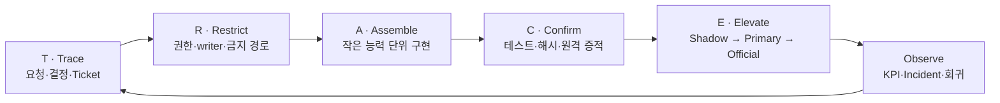
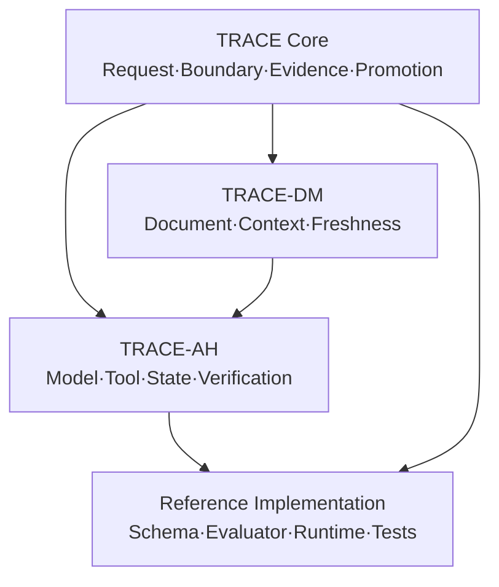

# TRACE Gate Framework

추적 가능하고 안전한 소프트웨어 변경·마이그레이션과 AI agent 실행을 위한 증거 기반 프레임워크입니다.

> 속도는 Gate를 생략해서 얻는 것이 아니라, 경계를 명확히 하고 검증과 복구를 자동화해서 얻습니다.

## TRACE

| 축 | 의미 | 핵심 질문 |
|---|---|---|
| **T — Trace** | 요청과 결정의 추적성 | 왜 이 작업을 하며 누가 무엇을 승인했는가? |
| **R — Restrict** | 권한과 영향 범위 제한 | 무엇을 바꿀 수 있고 절대 바꾸면 안 되는가? |
| **A — Assemble** | 되돌릴 수 있는 능력 단위 조립 | 큰 전환을 어떤 작은 기능 조각으로 나눌 것인가? |
| **C — Confirm** | 테스트와 증적으로 사실 확인 | 성공했다는 주장을 어떤 근거로 증명하는가? |
| **E — Elevate** | Gate를 통한 단계적 승격 | 언제 shadow를 primary 또는 official로 승격할 것인가? |



## 문서

- [TRACE Gate Framework 전체 문서](docs/TRACE-GATE-FRAMEWORK.ko.md)
- [TRACE Document Management Subframework](docs/subframeworks/TRACE-DOCUMENT-MANAGEMENT.ko.md): 문서 정본·계보, 목적 기반 접근과 선택적 그룹 embedding
- [TRACE Agent Harness Subframework](docs/subframeworks/TRACE-AGENT-HARNESS.ko.md): model·tool·verification·checkpoint와 선택적 multi-agent 계약
- [참조 구현 사용 가이드](docs/REFERENCE-IMPLEMENTATION.ko.md)
- [관리 문서 메타데이터 Manifest](docs/managed-document-manifest.yaml): 저장소 Markdown의 identity·hash·lineage·freshness·access envelope
- [변경 기록](CHANGELOG.md)
- [기여 가이드](CONTRIBUTING.md)

## 프레임워크 구성



## 바로 사용하기

`templates/`에서 다음 파일을 프로젝트에 복사해 시작할 수 있습니다.

- `request-receipt.yaml`: 작업 전 요청·권한 Receipt
- `ticket.yaml`: 작고 검증 가능한 구현 단위
- `evidence-manifest.yaml`: commit·image·run·hash 증거 사슬
- `gate-decision.yaml`: KPI와 승격 판정
- `HANDOFF.md`: 다음 작업자·AI 세션을 위한 상태 인계
- `document-access-intent.yaml`: AI/LLM 접근 목적·대상·민감도 선언
- `document-read-profile.yaml`: 목적별 최소 tier·context budget·확대 조건
- `document-manifest.yaml`: 문서 revision·무결성·계보·freshness 계약
- `document-gate-receipt.yaml`: 사전 접근 심사와 문서 Gate 판정 증적
- `document-embedding-profile.yaml`: 선택 객체 그룹의 model·chunk·index·retrieval 정책
- `document-embedding-manifest.yaml`: source revision·vector·index digest와 freshness 증적
- `agent-run.yaml`: run context·budget·tool·verification 계약
- `tool-definition.yaml`: tool effect·risk·schema·idempotency 계약
- `subagent-task.yaml`: 제한된 하위 agent scope·lease·merge 계약

가장 작은 도입 단위는 다음 네 가지입니다.

1. Receipt before effect
2. 허용·금지 경계
3. 기계적으로 판정 가능한 Gate
4. 재현 가능한 Evidence

AI/LLM이 문서에 접근하는 프로젝트는 TRACE-DM의 목적 기반 접근 판정을 적용합니다. Semantic retrieval이 필요한 경우에만 선택한 객체 그룹에 embedding projection을 추가할 수 있으며, 별도 vector graph는 필수가 아닙니다. Agent가 tool을 실행하는 프로젝트는 TRACE-AH의 typed action, scoped Tool Registry, append-only checkpoint와 verifier loop를 적용합니다.

## 적용 대상

- 일반 소프트웨어 개발과 배포
- 서버·클라우드·아키텍처 이전
- 데이터 수집·정규화·승격 파이프라인
- 운영 자동화와 AI 에이전트 기반 개발
- 감사 가능성과 데이터 무결성이 중요한 프로젝트

## 버전

현재 TRACE core 문서 버전은 `1.1.0`입니다. TRACE-DM `0.2.0`과 TRACE-AH `0.1.0`은 각각 독립 버전을 가집니다.

## 템플릿 검증

Python 기반 참조 구현과 검증은 Python 3.11 이상의 프로젝트별 가상환경에서 실행합니다.

```bash
python3 -m venv .venv
.venv/bin/python -m pip install -e '.[dev]'
.venv/bin/python scripts/validate_templates.py
.venv/bin/python -m pytest -q
```

검증기는 YAML 중복 key, JSON Schema, 목적·민감도·tool risk·writer 경계의 semantic invariant를 확인합니다. Gate evaluator는 증적에서 status와 digest receipt를 계산합니다.

저장소의 모든 Markdown은 TRACE-DM 공통 metadata envelope를 partition manifest로 제공하며, 누락 문서·content hash·size·revision drift는 같은 검증에서 실패합니다. 문서를 변경한 뒤에는 다음 명령으로 content-derived field를 갱신합니다.

```bash
.venv/bin/python scripts/update_document_manifest.py
```

```bash
.venv/bin/python scripts/evaluate_gate.py \
  templates/gate-decision.yaml \
  examples/gate-facts.yaml
```

`.venv`는 저장소에 포함하지 않습니다.

## 라이선스

Copyright © 2026 polargomz.

별도로 표시하지 않은 이 저장소의 문서, 도표와 템플릿은
[Creative Commons Attribution 4.0 International](https://creativecommons.org/licenses/by/4.0/)에 따라 제공됩니다.

누구나 상업적 목적을 포함해 공유·수정·재배포할 수 있습니다. 재배포할 때는 적절한 저작자 표시와 라이선스 링크를 제공하고, 변경했다면 그 사실을 밝혀야 합니다. 자세한 조건은 [`LICENSE`](LICENSE)를 확인하세요.
