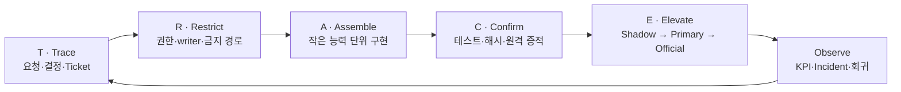
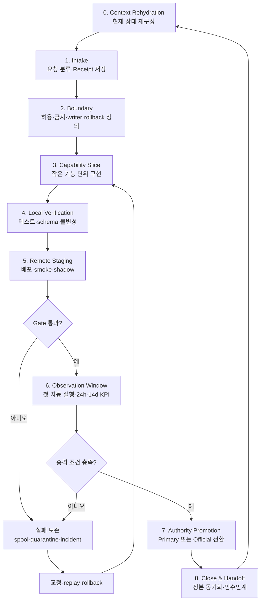
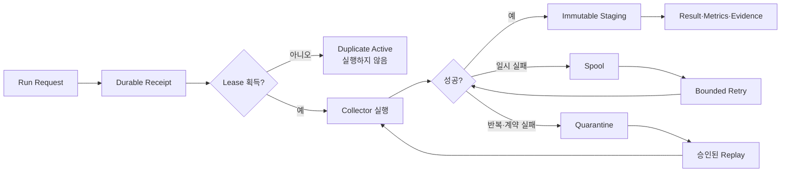
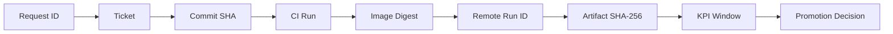
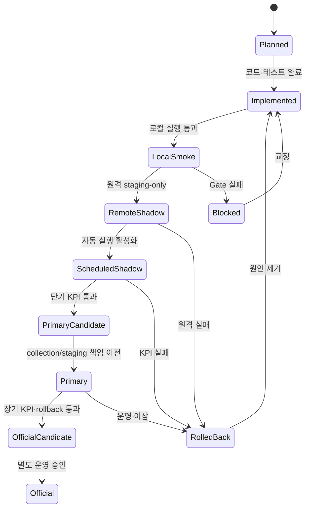
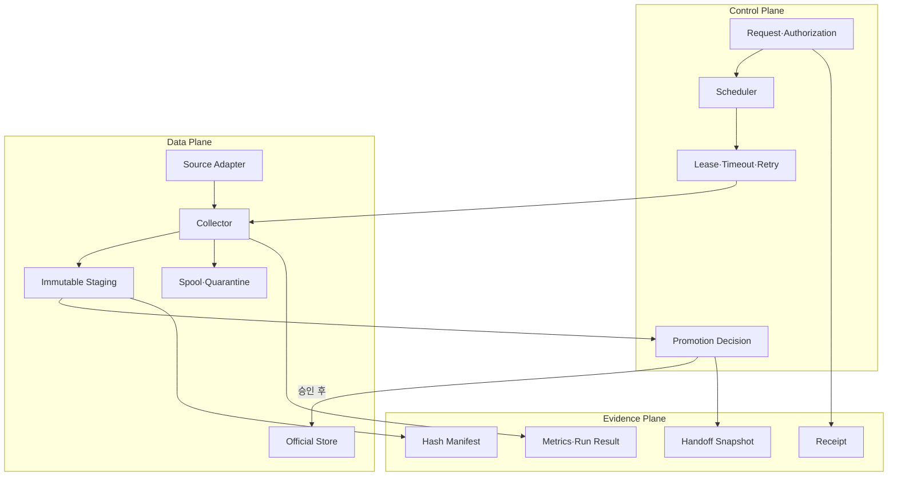

# TRACE Gate Framework

> 추적 가능하고 안전한 소프트웨어 변경·마이그레이션을 위한 증거 기반 실행 프레임워크

- 버전: 1.0.0
- 언어: 한국어
- 저작자: polargomz
- 라이선스: [CC BY 4.0](https://creativecommons.org/licenses/by/4.0/)
- 적용 대상: 일반 소프트웨어 개발, 인프라 이전, 데이터 파이프라인, 자동화 시스템, AI 에이전트 기반 개발
- 핵심 목표: **빠르게 진행하되, 권한·데이터·운영 안정성을 잃지 않고 실제 기능을 단계적으로 이전한다.**

---

## 1. 프레임워크 개요

TRACE는 다음 다섯 원칙의 머리글자다.

| 축 | 의미 | 핵심 질문 |
|---|---|---|
| **T — Trace** | 요청과 결정의 추적성 | 왜 이 작업을 하며 누가 무엇을 승인했는가? |
| **R — Restrict** | 권한과 영향 범위 제한 | 무엇을 바꿀 수 있고 절대 바꾸면 안 되는가? |
| **A — Assemble** | 되돌릴 수 있는 능력 단위 조립 | 큰 전환을 어떤 작은 기능 조각으로 나눌 것인가? |
| **C — Confirm** | 테스트와 증적으로 사실 확인 | 성공했다는 주장을 어떤 재현 가능한 근거로 증명하는가? |
| **E — Elevate** | Gate를 통한 단계적 승격 | 언제 shadow를 primary 또는 official로 승격할 것인가? |

TRACE Gate Framework는 단순한 개발 절차가 아니다. 다음 네 가지를 하나의 운영 체계로 묶는다.

1. 요청·권한 관리
2. 구현·검증 흐름
3. 런타임 안정성과 데이터 무결성
4. 상태·증적·인수인계 관리



---

## 2. 언제 사용하는가

다음 상황에서 특히 효과적이다.

- 기존 시스템을 새 서버·클라우드·아키텍처로 이전할 때
- 여러 writer 또는 자동화가 같은 데이터나 저장소를 수정할 때
- 배포 성공보다 데이터 무결성과 감사 가능성이 더 중요한 프로젝트
- AI 에이전트가 코드·GitHub·서버·외부 시스템을 함께 다룰 때
- 장기간에 걸쳐 여러 작업자나 세션이 이어서 작업할 때
- 실패를 삭제하지 않고 재현·분류·복구해야 하는 파이프라인
- “빨리 옮기되 공식 운영 권한은 안전하게 유지”해야 하는 전환

다음과 같은 작은 작업에는 전체 구성을 적용할 필요가 없다.

- 외부 side effect가 없는 짧은 분석
- 단일 파일의 사소한 수정
- 운영 데이터·배포·권한과 무관한 일회성 실험

이 경우에도 최소한 `요청`, `변경 범위`, `검증 결과` 세 항목은 남긴다.

---

## 3. 전체 생명주기



핵심은 “코드가 존재한다”와 “운영 권한을 이전했다”를 분리하는 것이다. 구현 완료, 배포 완료, shadow 성공, KPI 통과, writer 권한 전환은 서로 다른 상태다.

---

## 4. 핵심 요소 15개

### 4.1 Context Rehydration — 작업 전에 현실을 다시 읽는다

새 작업자나 새 세션은 이전 대화의 기억만 믿지 않는다. 다음을 정해진 순서로 읽는다.

- 진입점 문서와 운영 지침
- 최신 상태 정본
- 현재 Stage와 Gate
- 열린 Ticket·Incident·PR
- 최신 불변 handoff snapshot
- 실제 Git·CI·원격 시스템 상태

원칙:

- 요약은 원문을 대체하지 않는다.
- 문서와 실제 상태가 다르면 실제 control plane과 런타임을 우선한다.
- 읽지 않은 상태에서 완료·실패·운영 여부를 추정하지 않는다.

AI/LLM의 문서 접근은 [TRACE Document Management Subframework](subframeworks/TRACE-DOCUMENT-MANAGEMENT.ko.md)를 사용할 수 있다. 실행 화면이나 제품명이 아니라 접근 목적을 먼저 분류하고, Manifest와 freshness를 검증한 뒤 Summary → Overview → 선택 Records 순으로 필요한 최소 문맥만 확대한다.

### 4.2 Canonical Request Receipt — side effect 전에 요청을 고정한다

파일 수정, push, PR, 배포, 일정 변경 등 상태를 바꾸기 전에 요청을 정본에 저장한다.

필수 항목:

- 고유 Request ID
- 요청 원문과 접수 시각
- 목적과 비목적
- 영향 범위
- 승인된 side effect
- 금지된 작업
- 완료 조건
- 부모·자식 요청 관계
- `pre_action_gate=passed`

이 Receipt는 “무엇을 할 것인가”뿐 아니라 “무엇을 하지 않을 것인가”를 증명한다.

### 4.3 Explicit Authorization — 권한을 단계별로 분리한다

다음 권한은 서로 자동으로 포함되지 않는다.

| 단계 | 예시 |
|---|---|
| 읽기 | 저장소·PR·서버 상태 조회 |
| 로컬 변경 | 코드·문서 수정 |
| Git 기록 | stage·commit |
| 원격 게시 | push·PR 생성/수정 |
| 배포 | 서버 파일·컨테이너·서비스 변경 |
| 운영 전환 | timer 활성화·traffic 전환·writer 승격 |
| 파괴적 작업 | 삭제·force push·schema 파괴·데이터 덮어쓰기 |

한 단계의 승인은 다음 단계를 암묵적으로 허용하지 않는다.

### 4.4 Boundary Contract — 허용 경계와 금지 경로를 먼저 선언한다

구현 전에 다음을 명시한다.

```yaml
allowed_write_roots:
  - data/staging
  - data/quarantine
  - metrics

forbidden_write_roots:
  - data/official
  - data/latest
  - data/snapshots
  - audit/history

authority_changes_allowed: false
destructive_actions_allowed: false
```

테스트는 단순히 결과값만 검사하지 않고 금지 경로가 변경되지 않았는지도 검사해야 한다.

### 4.5 Single Writer — 한 논리 영역에는 한 writer만 둔다

동일 데이터를 여러 자동화가 직접 수정하면 순서·충돌·복구 책임이 불명확해진다.

권장 분리:

- Collector: 후보 원자료만 작성
- Promotion/Publisher: 승인된 후보만 공식 데이터로 승격
- Report service: 공식 데이터를 읽어 보고서 생성
- Registry owner: schema와 정책 변경

전환 기간에 임시 multi-writer가 필요하면 예외 기간, 충돌 처리, 종료 조건을 문서화한다.

### 4.6 Capability Slicing — Stage를 작은 능력 단위로 나눈다

“Stage 2 완료”처럼 큰 상태 대신 검증 가능한 체크리스트를 사용한다.

예시:

1. 입력·schema 계약
2. adapter 또는 핵심 기능
3. immutable staging writer
4. scheduler
5. spool·quarantine·replay
6. lease·timeout·retry
7. container hardening
8. 로컬 smoke
9. 원격 smoke
10. 첫 자동 실행
11. 관찰 KPI
12. rollback과 운영 승인

진행률은 느낌이 아니라 `완료된 항목 / 전체 항목`으로 표시한다.

### 4.7 Immutable Baseline — 변경 전 기준선을 해시로 고정한다

전환 전 다음을 기록한다.

- Git commit과 tree hash
- 중요 파일·디렉터리 SHA-256
- Docker image digest
- schema·parser version
- 현재 writer와 scheduler
- 원격 host·서비스 상태
- 최신 정상 run과 알려진 incident

검증 후 같은 값을 다시 계산해 “새 기능이 금지된 기존 영역을 건드리지 않았다”는 것을 입증한다.

### 4.8 Idempotency — 같은 입력의 재실행은 중복을 만들지 않는다

권장 키:

```text
sha256(source + logical_time + normalized_payload + schema_version + parser_version)
```

필수 동작:

- 동일 key 재처리는 성공으로 반환
- 중복 append 금지
- 기존 immutable object 수정 금지
- 새 parser는 새 lineage로 기록
- 수동 교정은 덮어쓰기 대신 새 revision append

### 4.9 Durable Failure Handling — 실패를 삭제하지 않는다



필수 구성:

- 실행 전 durable receipt
- single-active lease
- marker별 timeout과 전체 deadline
- 제한된 retry budget
- spool
- quarantine
- 승인된 replay
- 모든 attempt의 결과와 오류 코드

### 4.10 Multi-axis Verification — 한 종류의 테스트로 완료를 주장하지 않는다

검증 축:

| 축 | 검증 내용 |
|---|---|
| Contract | schema, 타입, 허용 경로, version |
| Unit | 순수 로직과 경계 조건 |
| Integration | 실제 adapter·스토리지·프로세스 연결 |
| Failure | timeout, retry, duplicate, quarantine, replay |
| Security | non-root, secret, port, read-only filesystem, 권한 |
| Integrity | before/after hash, immutable object, writer 불변 |
| Remote | 실제 대상 host에서 smoke |
| CI | 깨끗한 환경에서 반복 검증 |
| Operations | timer, restart, recovery, alert |

### 4.11 Evidence Chain — 실행 결과를 증거 사슬로 만든다



각 증적에는 최소한 다음을 기록한다.

- `observed_at`
- 관찰 주체와 host
- Request·Ticket ID
- commit SHA와 image digest
- run ID
- 입력·출력 hash
- 실행 결과와 종료 코드
- 테스트 수와 실패 수
- 비밀정보를 제거한 log
- 원격 원본과 보관 사본의 hash 일치 여부

원격 raw evidence는 저장소 밖에 보존하고, 저장소에는 정제된 manifest와 hash만 등록하는 방식이 안전하다.

### 4.12 Fact / Inference / Unknown — 사실과 추론을 분리한다

상태 보고에는 다음 세 범주를 사용한다.

- **Fact:** 직접 조회하거나 검증한 값
- **Inference:** 여러 사실로부터 도출한 판단
- **Unknown:** 권한·연결·시간 부족 등으로 확인하지 못한 항목

예:

```text
Fact: timer는 enabled/active이고 다음 실행 시각이 존재한다.
Inference: scheduler 구성은 정상일 가능성이 높다.
Unknown: 다음 실행이 실제로 성공할지는 아직 관찰되지 않았다.
```

### 4.13 Shadow-first Promotion — 기능과 권한을 따로 승격한다



승격 예시:

1. 코드 존재
2. 로컬 테스트 통과
3. 원격 수동 shadow 통과
4. 자동 staging-only 실행
5. 첫 자동 run 통과
6. 24시간 KPI 통과
7. primary collection/staging으로 지정
8. 14일 KPI와 rollback rehearsal 통과
9. 별도 승인 후 official writer 전환

중요: 낮은 단계의 성공은 높은 단계의 권한을 자동 부여하지 않는다.

### 4.14 Rollback as a Product — rollback을 사후 문서가 아니라 기능으로 만든다

최소 기준:

- 이전 image digest 또는 release artifact
- scheduler·consumer 비활성화 절차
- traffic 또는 writer 되돌림 절차
- DB migration의 down 또는 forward-fix
- 최신 데이터 reconciliation 방법
- rollback 결정권자
- 목표 RTO·RPO
- 실패 증적 보존 규칙

rollback rehearsal이 실행되지 않았다면 “rollback 준비 완료”로 표시하지 않는다.

### 4.15 Synchronized Truth & Handoff — 정본과 인수인계를 함께 갱신한다

완료 시 다음 항목이 같은 상태를 가리켜야 한다.

- Request registry
- Ticket DB
- append-only event log
- Stage status
- 운영 dashboard 또는 Manual
- PR 본문
- evidence manifest
- handoff pointer와 immutable snapshot

새 세션은 대화 기억이 아니라 이 묶음을 통해 현재 상태를 재구성한다.

#### TRACE-DM 하부 프레임

[TRACE Document Management Subframework](subframeworks/TRACE-DOCUMENT-MANAGEMENT.ko.md)는 Context Rehydration, Evidence Chain과 Synchronized Truth를 문서 lifecycle에 적용한다. 문서 identity·revision·정본·projection을 분리하고, AI/LLM 접근 전에 목적·권한·민감도·freshness·context budget을 심사한다. TRACE core의 Request Receipt와 Explicit Authorization을 대체하지 않으며 문서 관련 세부 Gate 결과를 Evidence Chain에 반환한다.

---

## 5. 세 개의 Plane으로 시스템을 설계한다



### Control Plane

누가, 언제, 어떤 작업을 실행하고 승격할 수 있는지 결정한다.

### Data Plane

실제 데이터 또는 산출물을 생성·저장한다. staging과 official을 물리적으로 분리한다.

### Evidence Plane

무엇이 실제로 일어났는지 재현 가능한 형태로 보존한다. Evidence Plane은 Data Plane의 성공 주장에 종속되지 않고 독립 검증 가능해야 한다.

---

## 6. 단계별 실행 절차

| 단계 | 핵심 작업 | 필수 Gate | 산출물 |
|---|---|---|---|
| 0. Rehydrate | 문서·Git·CI·runtime 재조회 | 기준선 확인 | current-state note |
| 1. Intake | 요청 분류·Receipt | pre-action passed | request receipt |
| 2. Bound | 허용/금지·writer·rollback 정의 | blast radius 승인 | boundary contract |
| 3. Implement | capability slice 구현 | 테스트 가능한 단위 | code·schema·tests |
| 4. Verify | local·CI·failure·integrity 검증 | 모든 필수 validator 성공 | test evidence |
| 5. Shadow | 원격 staging-only 배포 | official 영역 불변 | remote smoke evidence |
| 6. Observe | 자동 run·KPI·incident 관찰 | 시간 기반 KPI 충족 | KPI record |
| 7. Promote | primary/official 권한 이전 | 별도 승인·rollback 준비 | promotion receipt |
| 8. Close | 정본·문서·handoff 동기화 | DoD 충족 | immutable snapshot |

---

## 7. Gate 설계법

좋은 Gate는 주관적 문장이 아니라 기계적으로 판정할 수 있는 조건이다.

나쁜 예:

```text
충분히 안정적으로 보이면 전환한다.
```

좋은 예:

```yaml
gate: stage2_primary_collection
required:
  unit_tests: pass
  integration_tests: pass
  remote_smoke_runs: 1
  scheduled_runs: ">= 12"
  collection_success_rate: ">= 99%"
  freshness_p95_minutes: "<= 15"
  duplicate_writes: 0
  forbidden_root_changes: 0
  rollback_rehearsal: pass
  explicit_approval: required
```

Gate마다 다음을 명시한다.

- 판정자
- 입력 증적
- threshold
- 평가 가능 시각
- 실패 시 상태
- 재시도 조건
- rollback 여부
- 다음 권한 범위

---

## 8. KPI와 관찰 창

시간 기반 검증은 즉시 완료할 수 없다. `timer가 켜졌다`와 `timer가 안정적으로 운영됐다`를 분리한다.

권장 KPI:

- collection success rate
- due coverage
- freshness lag p50/p95/p99
- retry·timeout 비율
- quarantine 발생률
- duplicate write 수
- schema validation 실패 수
- shadow mismatch 비율
- recovery time
- 공식 데이터 불변 위반 수

관찰 단계 예시:

| 창 | 목적 | 통과 후 허용 가능한 승격 |
|---|---|---|
| 첫 자동 run | scheduler와 자격증명 확인 | staging 자동화 유지 |
| 24시간 | 단기 주기·재시작·일시 장애 확인 | primary candidate |
| 7~14일 | 시장일·주말·시간대·source 변동 확인 | primary 또는 official candidate |
| rollback rehearsal | 복구 절차 실증 | official 전환 승인 가능 |

baseline 또는 수동 smoke 결과는 자동 관찰 KPI에서 분리한다.

---

## 9. Git·PR 변경관리 계약

기본 규칙:

1. 기본 branch를 직접 수정하지 않는다.
2. 작업마다 feature branch를 사용한다.
3. force push를 금지하거나 매우 제한한다.
4. PR은 Request ID와 Ticket ID를 포함한다.
5. 관련 없는 변경을 같은 commit에 섞지 않는다.
6. 최신 base와의 차이를 merge 전 재확인한다.
7. CI 결과는 정확한 head commit에 연결한다.
8. merge 뒤 main에서 핵심 검증을 다시 수행한다.
9. publication commit과 implementation commit을 구분한다.
10. 역사적 immutable artifact는 compatibility layer로 처리하고 원본을 덮어쓰지 않는다.

PR 완료 조건 예시:

```text
- [ ] Request receipt 존재
- [ ] Ticket 연결
- [ ] 변경 파일이 승인 범위와 일치
- [ ] unit/integration/failure tests 통과
- [ ] schema·governance validator 통과
- [ ] secret 또는 민감정보 없음
- [ ] remote evidence 연결
- [ ] rollback 조건 기록
- [ ] status·handoff 동기화
```

---

## 10. AI 에이전트와 원격 운영 보안

AI 에이전트가 서버를 직접 운영할 때는 일반 관리자 shell 대신 최소 권한의 운영 인터페이스를 제공한다.

권장:

- 전용 계정과 전용 SSH key
- 읽기 권한과 변경 권한 분리
- 고정된 root-owned wrapper
- 정확한 명령 단위의 제한된 `sudo -n`
- agent·port·X11 forwarding 비활성
- 비밀정보를 repository·prompt·log에 출력하지 않음
- 원격 명령과 결과 audit log
- staging 배포와 official 권한 전환 분리

피해야 할 구성:

- `NOPASSWD: ALL`
- root SSH shell
- 개인 관리자 key 공유
- `ssh host` 전체 prefix를 무조건 허용
- agent forwarding
- 인터넷에서 직접 접근 가능한 관리 포트
- AI가 수정 가능한 wrapper를 권한 allowlist에 등록

자동화 등급:

| 등급 | 예시 | 기본 정책 |
|---|---|---|
| Green | 상태 조회, hash, log, staging 결과 검사 | 자동 허용 가능 |
| Amber | staging 배포, 지정 서비스 재시작, replay | 자동 검토 또는 실행별 승인 |
| Red | 권한·방화벽·official writer·삭제·DB 파괴 변경 | 사람 승인 필수 |

---

## 11. 빠르게 진행하는 방법

TRACE는 절차를 늘리기 위한 프레임워크가 아니다. 반복 질문과 재작업을 줄여 전체 시간을 단축한다.

### 병렬화할 것

- 저장소·CI·원격 상태의 읽기 전용 조회
- 서로 독립된 unit·schema·security 테스트
- 여러 host의 상태 확인
- 문서·Ticket·evidence 초안 준비

### 직렬화할 것

- Receipt 저장 이후의 side effect
- writer 권한 변경
- schema migration
- 데이터 promotion
- destructive 작업
- Gate 판정과 다음 단계 승격

### 마찰을 줄일 것

- 고정된 검증 스크립트
- 전용 운영 wrapper
- 기계 판정 가능한 Gate
- 자동 생성되는 manifest
- 동일한 container image
- 한 번에 확인 가능한 status dashboard
- 다음 세션이 바로 시작할 수 있는 handoff packet

### 절대로 생략하지 않을 것

- 금지 경로 확인
- before/after 불변성
- 실패 기록
- 실제 원격 검증
- KPI 시간 창
- rollback
- 별도 권한 승격 승인

---

## 12. 권장 저장소 구조

```text
project/
├── README.md
├── GOVERNANCE.md
├── requests/
│   ├── registry.json
│   ├── receipts/
│   └── policy.md
├── tickets/
│   ├── tickets.json
│   ├── events.jsonl
│   └── lifecycle.md
├── stages/
│   ├── stage-1/STATUS.md
│   ├── stage-2/STATUS.md
│   └── gates.yaml
├── deploy/
│   ├── containers/
│   └── services/
├── evidence/
│   ├── manifests/
│   └── sanitized/
├── incidents/
├── handoff/
│   ├── manifest.json
│   ├── CURRENT.md
│   └── snapshots/
├── scripts/
├── tests/
└── .github/workflows/
```

작은 프로젝트는 `requests`, `tickets`, `stages`를 하나의 `project-status.md`로 합쳐도 된다. 다만 immutable evidence와 현재 상태는 분리하는 것이 좋다.

---

## 13. 재사용 템플릿

### 13.1 Request Receipt

```yaml
request_id: REQ.YYYYMMDD.HHMM.SHORT.NAME
received_at: 2026-01-01T09:00:00+09:00
request_text: "사용자 원문"
parent_request_id: null
status: in_progress
decision: IMPLEMENT_AND_VALIDATE

scope:
  goals: []
  non_goals: []
  allowed_side_effects: []
  forbidden_actions: []

boundaries:
  allowed_write_roots: []
  forbidden_write_roots: []
  writer_authority_change: false

completion:
  required_artifacts: []
  required_tests: []
  required_gates: []

pre_action_gate:
  classified_before_execution: true
  gate_status: passed
  passed_at: 2026-01-01T09:01:00+09:00
```

### 13.2 Ticket

```yaml
ticket_id: PROJ-123
request_id: REQ.YYYYMMDD.HHMM.SHORT.NAME
title: "작고 검증 가능한 능력"
status: planned
dependencies: []
artifacts: []
acceptance_criteria: []
verification: []
blockers: []
updated_at: null
```

### 13.3 Evidence Manifest

```yaml
evidence_id: EVD.YYYYMMDD.HHMM.RUN
request_id: REQ.YYYYMMDD.HHMM.SHORT.NAME
ticket_ids: []
observed_at: 2026-01-01T10:00:00+09:00

source:
  git_commit: null
  image_digest: null
  schema_version: null

runtime:
  host: null
  run_id: null
  exit_code: null
  status: null

validation:
  tests_passed: 0
  tests_failed: 0
  warnings: 0
  before_hash: null
  after_hash: null
  invariant_passed: false

artifacts:
  - path: null
    sha256: null

secrets_redacted: true
raw_evidence_location: null
```

### 13.4 Gate Decision

```yaml
gate_id: GATE.STAGE2.PRIMARY
evaluated_at: 2026-01-02T09:00:00+09:00
status: pass  # pass | fail | measuring | blocked
evidence_refs: []
thresholds:
  success_rate: ">= 99%"
  duplicate_writes: 0
  forbidden_changes: 0
  rollback_rehearsal: pass
decision:
  newly_allowed_authority: []
  still_forbidden: []
approved_by: null
```

### 13.5 Handoff Snapshot

```markdown
# Session Handoff

- observed_at:
- current main:
- active branch / PR:
- operating stage:
- work stage:
- latest successful run:
- current writer:
- active scheduler:
- open incidents:
- completed gates:
- measuring gates:
- blocked gates:
- forbidden actions:
- next exact action:
- required reading order:
```

---

## 14. Definition of Ready

구현을 시작하기 전에 다음 조건을 확인한다.

- [ ] 현재 상태와 base commit을 확인했다.
- [ ] Request Receipt가 저장됐다.
- [ ] 목표와 비목표가 분리됐다.
- [ ] 허용·금지 side effect가 명시됐다.
- [ ] writer와 데이터 소유권이 확인됐다.
- [ ] capability slice와 완료 조건이 있다.
- [ ] 실패·rollback 경로가 있다.
- [ ] 테스트와 증적 수집 방법이 있다.
- [ ] 외부 권한·secret·네트워크 조건이 확인됐다.

## 15. Definition of Done

- [ ] 승인된 범위의 산출물이 존재한다.
- [ ] unit·integration·failure 테스트가 통과했다.
- [ ] remote smoke 또는 실제 환경 검증이 통과했다.
- [ ] 금지 경로와 기존 공식 데이터가 불변이다.
- [ ] 정확한 commit·image·run·artifact hash가 기록됐다.
- [ ] KPI가 통과했거나 아직 측정 중임을 명확히 표시했다.
- [ ] rollback 절차가 검증됐다.
- [ ] Request·Ticket·status·evidence·handoff가 동기화됐다.
- [ ] 남은 blocker와 다음 Gate가 기록됐다.
- [ ] 별도 승인이 필요한 권한을 임의로 이전하지 않았다.

---

## 16. 상태 보고 형식

상태 보고는 다음 순서가 좋다.

1. 현재 결론
2. 직접 확인한 사실
3. 구현·운영 Stage의 차이
4. 통과한 Gate
5. 측정 중인 Gate
6. blocker와 위험
7. 가장 가까운 다음 행동
8. 변경 여부와 증적 위치

예시:

```text
현재 staging runtime은 배포되어 timer가 active다.
마지막 수동 smoke는 PASS지만 첫 자동 run은 아직 발생하지 않았다.
따라서 구현 Gate는 통과했고 운영 지속성 Gate는 measuring 상태다.
official writer는 기존 시스템에 남아 있다.
다음 행동은 첫 자동 run의 receipt, bundle, KPI 반영을 검증하는 것이다.
```

---

## 17. 대표적인 실패 패턴

| 실패 패턴 | 문제 | TRACE 대응 |
|---|---|---|
| 문서만 갱신하고 배포 완료 주장 | 실제 기능이 없음 | Remote smoke와 run evidence 요구 |
| timer 활성화를 안정 운영으로 간주 | 시간 기반 검증 누락 | 첫 run·24h·14d Gate 분리 |
| staging 성공 후 곧바로 official writer 전환 | blast radius 확대 | 권한 승격 별도 승인 |
| 실패 파일 삭제 | 원인과 replay 근거 소실 | spool·quarantine 보존 |
| 재실행 시 중복 데이터 생성 | idempotency 부재 | key·duplicate probe |
| 여러 writer가 같은 파일 수정 | 충돌·책임 불명 | single-writer·publisher 분리 |
| 최신 상태를 문서만 보고 판단 | drift 미발견 | control plane·runtime 직접 조회 |
| broad sudo 또는 root shell 자동화 | 보안 경계 붕괴 | 전용 계정·고정 wrapper·명령 allowlist |
| 과거 immutable 데이터를 현재 schema에 맞춰 수정 | 역사 왜곡 | 격리 compatibility hydration |
| 테스트 통과를 운영 성공으로 확대 해석 | 환경 차이 무시 | local·CI·remote·KPI 축 분리 |

---

## 18. 도입 수준

### Lightweight

소규모 애플리케이션에 적합하다.

- Request note
- feature branch·PR
- 허용/금지 범위
- 테스트 결과
- release note와 rollback

### Standard

대부분의 운영 프로젝트에 권장한다.

- Request registry·Ticket
- Stage checklist
- evidence manifest
- staging/shadow
- 24시간 KPI
- immutable handoff

### High Assurance

데이터·금융·인프라·보안 중요 프로젝트에 적합하다.

- append-only event ledger
- content hash chain
- 전용 control/data/evidence plane
- dual-run과 장기 KPI
- 강제 single-writer
- 별도 promotion authority
- 정기 rollback rehearsal
- 최소 권한 원격 실행 인터페이스

---

## 19. 실전 적용 순서

새 프로젝트에는 다음 순서로 도입한다.

1. `GOVERNANCE.md`에 writer·권한·금지 경로를 적는다.
2. Request Receipt 템플릿을 만든다.
3. Stage 체크리스트와 기계적 Gate를 정의한다.
4. staging과 official 저장 경로를 분리한다.
5. run ID·idempotency·receipt·result를 구현한다.
6. timeout·retry·spool·quarantine·replay 테스트를 추가한다.
7. before/after hash 검증을 자동화한다.
8. feature branch·PR·CI 계약을 연결한다.
9. shadow timer와 KPI 측정을 시작한다.
10. rollback rehearsal 후 별도 승인으로 권한을 승격한다.
11. immutable handoff snapshot으로 다음 작업자에게 넘긴다.

한 번에 모든 문서를 만들기보다, 실제 side effect를 통제하는 `Receipt`, `Boundary`, `Gate`, `Evidence` 네 가지부터 시작하는 것이 가장 효과적이다.

---

## 20. 한 장 요약

```text
READ REALITY
  현재 문서·Git·CI·runtime을 직접 확인한다.

RECEIPT BEFORE EFFECT
  변경 전에 요청·권한·완료 조건을 저장한다.

BOUND THE BLAST RADIUS
  허용 경로·금지 경로·writer를 고정한다.

BUILD REVERSIBLE SLICES
  작고 테스트 가능한 능력 단위로 구현한다.

PRESERVE FAILURE
  실패를 spool·quarantine·incident로 남긴다.

PROVE WITH EVIDENCE
  commit·image·run·hash·KPI를 연결한다.

SHADOW BEFORE AUTHORITY
  staging과 자동 관찰을 거친 뒤 권한을 이전한다.

ROLL BACK BY DESIGN
  복구를 문서가 아니라 실행 가능한 기능으로 만든다.

SYNC THE TRUTH
  Request·Ticket·status·evidence·handoff를 함께 갱신한다.
```

TRACE Gate Framework의 최종 원칙은 단순하다.

> **속도는 Gate를 생략해서 얻는 것이 아니라, 경계를 명확히 하고 검증과 복구를 자동화해서 얻는다.**

---

## 라이선스

Copyright © 2026 polargomz.

이 문서는 [Creative Commons Attribution 4.0 International](https://creativecommons.org/licenses/by/4.0/)에 따라 제공됩니다. 공유하거나 수정한 자료를 배포할 때는 적절한 저작자 표시와 라이선스 링크를 제공하고, 변경 사실을 밝혀야 합니다.
