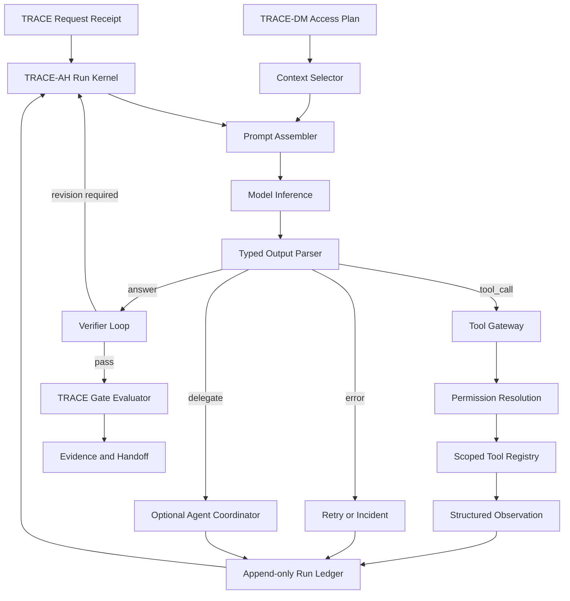
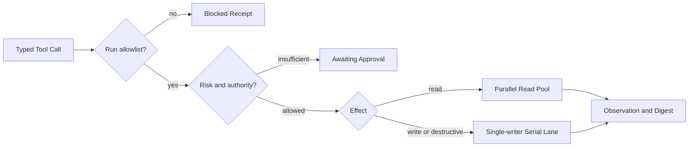
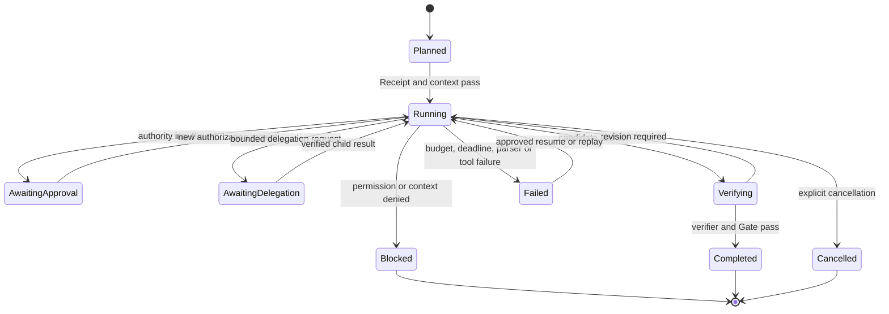

# TRACE Agent Harness Subframework

- Subframework ID: `TRACE-AH`
- Version: `0.1.0`
- Status: `proposed subframework specification with reference implementation`
- Parent framework: TRACE Gate Framework `1.1.0`
- Companion subframework: TRACE Document Management `0.2.0`
- Scope: AI agent의 문맥 조립, 모델 실행, tool 호출, 검증, checkpoint, 종료와 선택적 하위 agent 조정
- Portability: 특정 모델, provider, SDK와 실행 화면에 비종속
- License: CC BY 4.0

## 1. 목적

TRACE-AH는 TRACE core의 Request, Boundary, Confirmation과 Elevation 계약을 실제 agent 실행 주기에 연결한다. TRACE core가 “무엇이 허용되고 어떤 증거로 승격할 것인가”를 결정한다면 TRACE-AH는 승인 범위 안에서 “모델과 도구를 어떤 제한된 반복으로 실행할 것인가”를 규정한다.

TRACE-AH는 다음 실패를 통제한다.

- 모델 응답을 검증하지 않고 바로 mutation으로 실행
- 작업과 무관한 도구 또는 전체 문서를 prompt에 노출
- tool-call 반복으로 시간·비용·side effect가 무제한 증가
- 재시작 뒤 이전 tool 결과를 잃고 같은 mutation을 중복 실행
- 모델이 Gate 통과나 권한을 스스로 선언
- 여러 agent가 같은 논리 영역을 동시에 수정
- 하위 agent의 결과를 검증 없이 부모 결과로 병합

## 2. TRACE core 및 TRACE-DM과의 경계

| 영역 | 책임 주체 |
|---|---|
| 전역 Request와 side-effect 승인 | TRACE core |
| 문서 목적·freshness·sensitivity·context budget | TRACE-DM |
| prompt 조립과 모델/tool 실행 반복 | TRACE-AH |
| 최종 Gate와 authority promotion | TRACE core |
| 문서 revision과 projection | TRACE-DM |
| run event, checkpoint와 observation | TRACE-AH |

TRACE-AH는 승인, 인증 또는 정본 관리를 새로 만들지 않는다. 상위 Receipt와 TRACE-DM GateReceipt를 입력으로 소비하고, 실행 결과와 evidence reference를 상위 Evidence Chain에 반환한다.

## 3. 전체 실행 구조

## 4. 핵심 불변조건

1. 모델 출력은 권한 부여가 아니다.
2. 모든 tool은 registry에 등록되고 현재 run allowlist에 포함돼야 한다.
3. read-only tool만 병렬 실행할 수 있다.
4. mutation은 논리 writer key마다 직렬 실행한다.
5. Amber tool은 authorization reference가 필요하다.
6. Red tool은 해당 tool을 명시한 별도 승인이 필요하다.
7. prompt는 사용한 Context Pack digest와 tool ID를 기록한다.
8. 모델 출력은 typed action으로 parsing되기 전 실행할 수 없다.
9. 모든 action, observation과 verification은 append-only ledger에 기록한다.
10. Gate 상태는 evaluator가 evidence input으로 계산하며 모델이나 작업자가 직접 `pass`로 기록하지 않는다.
11. budget·deadline·permission 실패는 fail-closed 상태로 종료한다.
12. 하위 agent는 부모 권한보다 넓은 권한을 상속할 수 없다.

## 5. Run Envelope

각 실행은 `templates/agent-run.yaml`에 해당하는 envelope를 가져야 한다.

필수 영역:

- `run_id`, `trace_id`, `request_id`
- Context Pack 또는 Access Intent reference
- step, tool-call, deadline, context budget
- 허용 tool과 authorization reference
- 필수 verifier
- budget·permission·approval 대기 종료 정책

Run Envelope 변경은 기존 run을 소급 수정하지 않는다. 범위나 권한이 확대되면 새 run revision 또는 새 Request 판정을 생성한다.

## 6. Context와 Prompt 조립

TRACE-AH는 TRACE-DM이 `allow` 또는 명시된 `allow_reduced`로 판정한 Context Pack만 prompt에 포함한다. Summary는 원본 증적의 대체물이 아니지만, source digest와 freshness가 검증된 경우 탐색과 일반 의사결정의 기본 projection으로 사용할 수 있다. Semantic retrieval을 사용한 경우에도 candidate ID가 일반 DocumentManifest Gate를 통과한 뒤 선택된 content만 포함한다. Full Records와 raw는 목적과 Gate가 요구할 때만 확대한다.

Prompt Envelope는 다음 계보를 보존한다.

- system instruction version
- Request ID와 run ID
- Context Pack digest
- 포함 artifact와 revision
- 허용 tool ID
- prompt 전체 digest

Provider별 message 형식으로 변환하더라도 이 논리 envelope를 잃어서는 안 된다.

## 7. Typed Output Contract

모델 출력은 다음 네 종류 중 하나다.

| 유형 | 필수 항목 | 의미 |
|---|---|---|
| `tool_call` | `tool_id`, `arguments` | 단일 tool 요청 |
| `tool_batch` | `calls` | 독립된 read-only 요청 묶음 |
| `answer` | `content` | verifier에 제출할 후보 답변 |
| `delegate` | 제한된 task contract | 선택적 하위 agent 요청 |
| `error` | `message` | 모델이 계속할 수 없음을 보고 |

알 수 없는 유형, 누락 field 또는 schema mismatch는 실행하지 않고 parsing failure로 기록한다. 자유 형식 텍스트에서 shell 명령이나 권한을 추론해 실행해서는 안 된다.

## 8. Tool Registry와 Policy Enforcement

각 Tool Definition은 최소 다음을 선언한다.

- 안정적인 `tool_id`와 설명
- 입력 schema
- `read`, `write`, `destructive` effect
- `green`, `amber`, `red` risk
- 허용·금지 대상 경계
- timeout과 retry
- idempotency 전략
- argument·output 증적과 redaction
- rollback 또는 compensating action

Tool handler가 성공을 보고하더라도 Evidence Plane은 output digest와 불변조건을 독립 검증한다.

## 9. State, Checkpoint와 Resume

Run Ledger는 JSONL 또는 동등한 append-only store로 다음 event를 순서대로 기록한다.

- `run_started`, `run_resumed`
- `model_action`
- `tool_observation`
- `verification`
- `delegation_requested`
- `run_blocked`, `run_failed`, `run_completed`

각 event는 sequence, 이전 event digest와 자체 digest를 가진다. Resume은 기존 action과 observation을 재생해 문맥을 복원하고 완료된 mutation을 다시 실행하지 않는다. 운영 구현은 idempotency key와 durable receipt를 tool adapter에도 전달해야 한다.

## 10. Verification Loop와 Gate Evaluator

Verifier는 후보 답변을 수정할 수 있는 권한자가 아니라 판정 증적 생산자다. 가능한 검증 순서는 다음과 같다.

1. deterministic schema와 contract test
2. unit·integration·failure test
3. diff·hash·금지 경로 검사
4. 필요 시 visual 또는 domain verifier
5. 필요 시 독립 model judge
6. 정확한 evidence input을 Gate evaluator에 전달

Gate evaluator는 policy, facts, evaluator ID·version을 canonical serialization해 input digest를 만든다. 결과는 `pass`, `fail`, `blocked` 중 하나이며 증적 누락은 `blocked`다. 사람이 생성한 설명은 결과를 보충할 수 있지만 status를 덮어쓸 수 없다.

## 11. 오류와 종료 상태

Retry는 error class, attempt budget과 idempotency 조건이 명시된 경우만 허용한다. permission denial, schema mismatch, hash mismatch, destructive approval 누락은 자동 retry하지 않는다.

## 12. 선택적 Multi-agent 계약

Multi-agent는 기본 실행 모델이 아니다. 독립된 읽기 조사, 서로 겹치지 않는 변경 범위 또는 전문 verifier처럼 단일 agent보다 분리가 유리한 경우에만 사용한다.

Subagent Task Contract는 다음을 고정한다.

- 부모 run과 자식 trace
- 단일하고 검증 가능한 objective
- read root, write root, forbidden root
- 허용 tool과 context 범위
- writer key와 lease expiry
- deadline과 부모 cancel 전파
- artifact digest와 evidence handoff
- merge 및 conflict 정책

두 child가 같은 artifact path에 다른 digest를 제출하면 자동 선택하지 않고 merge를 `blocked`로 판정한다. 같은 writer key에는 동시에 하나의 active lease만 허용한다.

## 13. 보안 모델

- 모델은 policy decision point가 아니다.
- Tool Gateway는 policy enforcement point다.
- authorization reference는 검증 가능한 외부 Receipt를 가리켜야 한다.
- prompt, log와 evidence에는 secret을 기록하지 않는다.
- Red tool 권한은 일반 session 또는 부모 agent에서 자동 상속하지 않는다.
- raw context 접근과 외부 공개 권한을 분리한다.
- tool output도 신뢰되지 않은 입력으로 취급한다.
- provider 장애나 malformed output은 권한 완화의 이유가 될 수 없다.

## 14. 적합성 수준

| Level | 기준 |
|---|---|
| `TRACE-AH-L0 Contracted` | Run Envelope, typed action, tool registry |
| `TRACE-AH-L1 Governed` | authorization enforcement, budgets, append-only observations |
| `TRACE-AH-L2 Durable` | checkpoint/resume, idempotency, failure preservation |
| `TRACE-AH-L3 Verified` | verifier loop, deterministic Gate evaluator, CI 네거티브 테스트 |
| `TRACE-AH-L4 Coordinated` | bounded subagent, writer lease, cancellation과 conflict-safe merge |

상위 수준은 하위 수준을 모두 포함한다. Multi-agent가 필요 없는 구현은 L3를 완전 적합성 목표로 사용할 수 있으며 L4를 주장할 필요가 없다.

## 15. 참조 구현의 범위

이 저장소의 `src/trace_gate`는 다음을 실행 가능한 예제로 제공한다.

- JSON Schema 및 semantic contract validator
- deterministic Gate evaluator와 digest receipt
- TRACE-DM context selector와 prompt envelope
- typed model/tool/verifier orchestration loop
- read-only batch와 serial mutation gateway
- append-only JSONL checkpoint와 resume
- single-writer lease, cancel propagation과 conflict-safe merge

참조 구현은 인증 provider, secret manager, 분산 lease, 실제 LLM SDK, 원격 executor 또는 cryptographic signer를 제공하지 않는다. 운영 환경은 해당 adapter를 구현하고 TRACE GateReceipt에 버전과 증적을 연결해야 한다.

## 16. 도입 순서

1. 기존 tool을 inventory하고 effect·risk·scope를 등록한다.
2. Run Envelope와 budget을 적용한다.
3. 자유 형식 tool 실행을 typed action으로 교체한다.
4. TRACE-DM Context Pack과 prompt digest를 연결한다.
5. 모든 observation을 append-only ledger에 기록한다.
6. deterministic verifier와 Gate evaluator를 CI에 연결한다.
7. checkpoint/resume과 idempotency를 장애 테스트한다.
8. 실제 필요성이 확인될 때만 bounded subagent를 도입한다.

## 라이선스

Copyright © 2026 D. JEONG. CC BY 4.0에 따라 제공된다.
