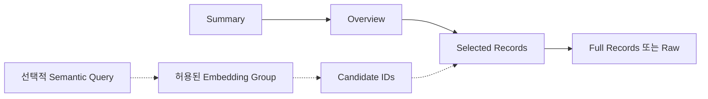
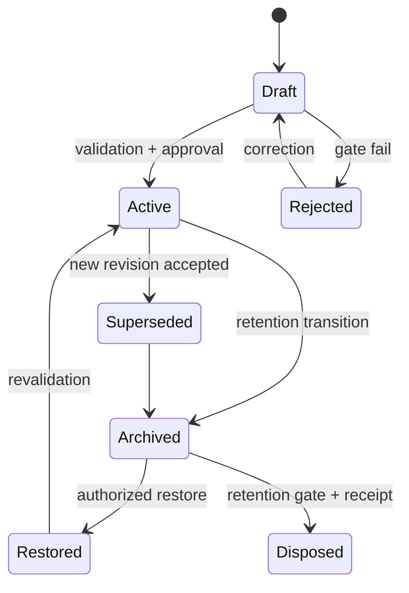
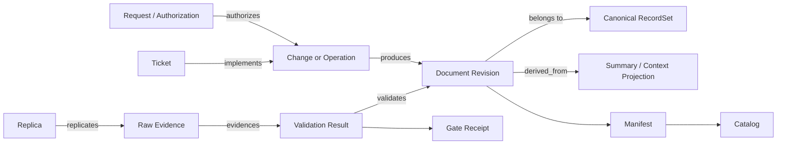
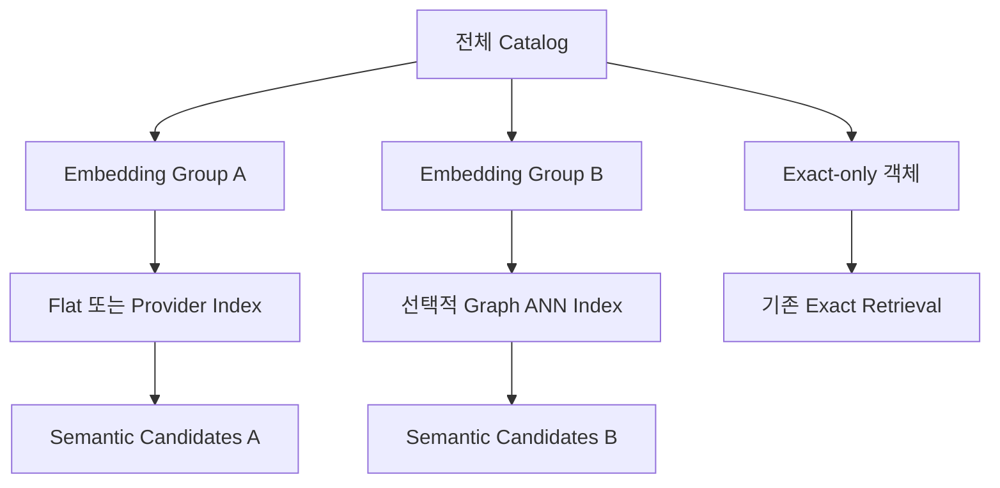
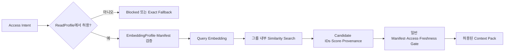
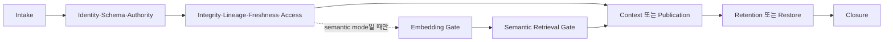
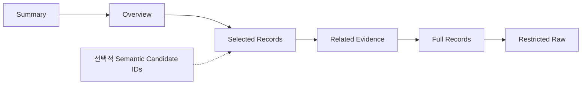
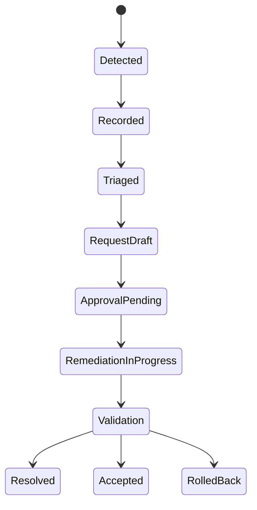

# TRACE Document Management Subframework

- Subframework ID: `TRACE-DM`
- Version: `0.2.0`
- Status: `proposed subframework specification`
- Parent framework: [`polargomz/trace-gate-framework`](https://github.com/polargomz/trace-gate-framework) `1.1.0`
- Parent compatibility: TRACE core `1.0.0–1.1.x`
- Parent axes: `Trace · Restrict · Assemble · Confirm · Elevate`
- Scope: 문서·원장·증적의 생성, 읽기, 변경, 추적, 보존과 폐기
- Normative dependency: TRACE Gate Framework의 Request, Boundary, Evidence, Promotion과 Handoff 계약
- Implementation portability: 저장소, 데이터베이스, 클라우드, 특정 LLM 또는 실행 도구에 비종속
- Author: polargomz
- License: [CC BY 4.0](https://creativecommons.org/licenses/by/4.0/)

## 1. 목적

TRACE Document Management Subframework(TRACE-DM)는 TRACE Gate Framework의 Evidence Plane과 `Context Rehydration`, `Evidence Chain`, `Synchronized Truth & Handoff` 원칙을 문서 lifecycle에 적용하는 공식 하부 프레임 편입 후보이다. 문서의 양을 단순히 줄이는 규격이 아니라, 정본과 감사 가능성을 유지하면서 사람과 AI agent가 현재 작업에 필요한 최소 문맥만 안전하게 읽고 필요할 때 원본까지 재구성할 수 있게 한다.

이 프레임은 다음 문제를 함께 해결한다.

- 동일한 현재 상태가 여러 문서에 반복되어 서로 달라지는 문제
- LLM이 매 세션마다 전체 원장과 이력을 읽어야 하는 문제
- Summary가 오래됐거나 원본과 달라도 이를 알 수 없는 문제
- Request, Ticket, 변경, 실행 결과와 증적의 연결이 끊기는 문제
- raw 증적과 정제 문서가 섞여 접근 범위가 과도하게 넓어지는 문제
- 불변 기록이 계속 누적되지만 보존·복구·폐기 기준이 없는 문제
- 일부 문서군에만 semantic retrieval이 필요해도 전체 정본을 벡터화하거나 별도 지식 그래프를 강제하는 문제

### 1.1 TRACE 안에서의 위치

TRACE-DM은 TRACE의 다섯 축을 문서 관리에 다음처럼 구체화한다.

| TRACE 축 | TRACE-DM 책임 |
|---|---|
| `T — Trace` | Request·Ticket·revision·evidence·GateReceipt의 계보 연결 |
| `R — Restrict` | canonical owner, 허용 revision, sensitivity, raw 접근과 금지 경로 제한 |
| `A — Assemble` | DocumentAsset·Revision·Manifest·Summary·ReadProfile을 되돌릴 수 있는 단위로 조립 |
| `C — Confirm` | schema·hash·size·lineage·freshness·재구성 가능성 검증 |
| `E — Elevate` | draft projection을 active·published·archived 정본 상태로 단계적 승격 |

TRACE-DM은 TRACE Gate Framework의 상위 승인 모델을 대체하지 않는다. Parent의 Receipt-before-effect와 Explicit Authorization을 통과한 뒤 문서 관련 세부 Gate를 평가하고 그 결과를 Parent의 Evidence Chain과 Handoff에 반환한다.

### 1.2 TRACE 생명주기 binding

| TRACE 단계 | TRACE-DM 동작 |
|---|---|
| `0. Context Rehydration` | Catalog·Manifest 검증 후 ReadProfile로 현재 문맥 복원 |
| `1. Intake` | 문서 목적·대상·operation을 Request와 연결 |
| `2. Boundary` | canonical owner, 허용·금지 위치, 접근·보존 경계 확정 |
| `3. Capability Slice` | revision, projection, validator를 작은 단위로 구현 |
| `4. Local Verification` | schema·integrity·lineage·freshness·음성 테스트 |
| `5. Remote Staging` | 정본을 건드리지 않는 draft/preview publication |
| `6. Observation Window` | freshness, context SLO, stale·drift incident 관찰 |
| `7. Authority Promotion` | Publication Gate 뒤 active/canonical authority 승격 |
| `8. Close & Handoff` | Catalog·Evidence·status·handoff 동기화와 Closure Gate |

### 1.3 TRACE Plane binding

| TRACE Plane | TRACE-DM 구성요소 | 경계 |
|---|---|---|
| `Control Plane` | Catalog, ReadProfile, canonical owner, lifecycle·publication decision | 문서 변경 가능 여부와 읽기 범위를 결정하되 내용을 직접 증명하지 않음 |
| `Data Plane` | DocumentRevision, RecordSet, raw·sanitized artifact, Summary·Overview projection | 실제 문서 내용과 산출물을 저장하되 스스로 성공을 승인하지 않음 |
| `Evidence Plane` | Manifest, EvidenceLink, hash, validator result, GateReceipt, Handoff reference | Data Plane의 주장을 독립 검증하고 TRACE Evidence Chain에 연결 |

TRACE-DM의 Evidence Plane은 Data Plane이 보고한 성공 상태를 그대로 신뢰해서는 안 된다. source revision과 hash를 독립적으로 확인하고 그 결과를 TRACE의 Confirm 및 Elevate 판정에 제공해야 한다.

## 2. 규범 언어

`MUST`, `MUST NOT`, `SHOULD`, `SHOULD NOT`, `MAY`는 각각 필수, 금지, 권장, 비권장, 선택을 뜻한다.

구현이 `TRACE-DM conformant`를 주장하려면 TRACE Gate Framework의 적용 수준과 이 문서의 Core Gate·무결성 불변조건을 모두 만족해야 한다. Parent Framework는 더 강한 조건을 추가할 수 있지만 TRACE-DM의 fail-closed 조건을 약화해서는 안 된다.

## 3. 적용 범위와 비범위

### 적용 범위

- 정책, 계획, 상태, Request, Ticket, 사건, 실행 로그와 증적 문서
- Markdown, JSON, JSONL, 데이터베이스 row, object storage object
- 사람이 작성한 문서와 자동 생성 projection
- 로컬·원격 원본, 복제본, 정제본과 cold archive
- 대화형 UI, CLI, API, 자율 agent, batch processor 등 모든 AI/LLM 소비자의 읽기 문맥
- 선택된 문서 객체 그룹의 embedding projection과 semantic candidate retrieval

### 비범위

- 비즈니스 도메인별 문서 내용 자체의 의미 결정
- TRACE Gate Framework의 사용자 인증, Request Receipt 또는 외부 실행 승인 대체
- hash만으로 문서 작성자의 신원 또는 출처를 인증하는 것
- raw 데이터를 Summary로 대체하거나 historical record를 다시 쓰는 것
- 모든 문서의 embedding 생성 또는 별도 vector graph 운영 강제
- similarity score를 canonical lineage, 사실 또는 authorization으로 승격하는 것

## 4. 핵심 불변조건

1. **정본 우선:** Summary, Overview와 Context Pack은 정본이 아니라 projection이다.
2. **단일 mutable fact:** 바뀔 수 있는 한 사실에는 하나의 canonical owner만 둔다.
3. **불변 이력:** 확정된 historical record는 수정하지 않고 correction 또는 superseding revision을 추가한다.
4. **계보 보존:** 모든 projection과 복제본은 원본 또는 부모 artifact까지 역추적할 수 있어야 한다.
5. **무결성 검증:** 참조 artifact의 hash, size, schema와 freshness를 읽기 전에 검증한다.
6. **자기 hash 금지:** 문서가 자기 자신의 전체 hash를 내부 필드로 보유하지 않는다.
7. **최소 공개:** 정상 읽기 프로필은 raw, secret, 전체 history를 기본으로 포함하지 않는다.
8. **Fail closed:** stale, missing, hash mismatch, unauthorized 상태에서는 축약본을 신뢰하지 않는다.
9. **재구성 가능:** 보존 대상 원장은 정의된 순서와 revision으로 전체 상태를 재구성할 수 있어야 한다.
10. **행위와 증적 분리:** 문서 등록은 외부 시스템 변경 승인을 의미하지 않는다.
11. **Embedding 비정본:** vector와 semantic index는 source revision에서 재생성 가능한 projection이며 정본·Evidence·명시적 관계를 대체하지 않는다.
12. **부분 적용:** embedding은 명시된 객체 그룹에만 적용할 수 있고, 그룹 밖 문서는 기존 exact retrieval만으로 정상 동작해야 한다.
13. **후보와 접근 분리:** similarity 결과는 후보 identity일 뿐이다. 실제 내용은 기존 Manifest·freshness·access·context Gate를 다시 통과해야 한다.
14. **추론 관계 분리:** embedding 유사도는 `derived_from`, `supersedes`, `evidences` 같은 명시적 Trace 관계를 생성하지 않는다.

## 5. 논리 객체 모델

| 객체 | 역할 | 정본 여부 |
|---|---|---|
| `DocumentAsset` | 논리 문서의 안정적인 identity | 정본 metadata |
| `DocumentRevision` | 특정 시점의 내용과 상태 | 정본 또는 불변 revision |
| `RecordSet` | 원장·레코드·event의 실제 내용 | 정본 |
| `Summary` | 현재 핵심 상태의 결정적 축약본 | 비정본 projection |
| `Overview` | 구조, 정책, 필드 의미와 읽기 지침 | 규범 문서 또는 projection |
| `Manifest` | tier, metadata, hash, lineage와 접근 계약 | companion 정본 |
| `Catalog` | 관리 대상 문서와 manifest의 탐색 인덱스 | 정본 index |
| `ReadProfile` | 작업 종류별 허용 문서·tier·예산 | 정책 정본 |
| `ContextPack` | 특정 작업을 위한 일회성 읽기 묶음 | 재생성 가능한 비정본 |
| `EvidenceLink` | Request·Ticket·revision·실행 결과 연결 | append-only trace record |
| `GateReceipt` | Gate 입력, 판정, 근거와 시각 | 불변 증적 |
| `EmbeddingProfile` | 선택 객체 그룹, source tier, model과 index 정책 | 선택적 정책 정본 |
| `EmbeddingProjection` | source chunk에서 생성한 vector와 index | 선택적 비정본 projection |
| `SemanticCandidateSet` | 특정 query가 찾은 artifact·revision·chunk 후보 | 일회성 비정본 |

각 객체는 stable ID를 가져야 한다. 경로나 URL은 위치이며 identity가 아니다. 위치가 바뀌어도 stable ID와 lineage는 유지해야 한다.

## 6. 단계적 읽기 구조



### Summary

첫 판단에 필요한 최소 상태만 제공한다.

- 현재 ID, 상태, count, 최근 변경 시각
- 열린 blocker와 다음 Gate
- source revision, source hash, generated time
- Overview와 Records 위치

Summary는 정본에서 결정적으로 재생성되어야 하며 사람이 직접 현재 값을 고치는 방식은 허용하지 않는다. Summary는 증적 원본을 대체하지 않지만 source revision·hash와 freshness가 검증되면 lookup·일반 decision support의 기본 context projection으로 사용할 수 있다. 원본 확대는 목적과 Gate가 요구할 때만 수행한다.

### Overview

문서군의 의미와 읽는 방법을 설명한다.

- 목적과 범위
- canonical owner
- schema와 상태 전이
- 관계와 선택 기준
- 실패 시 fallback
- retention과 접근 등급

Overview에는 자주 바뀌는 run count나 latest SHA 같은 mutable fact를 복제하지 않는 것을 원칙으로 한다.

### Records

실제 정본과 이력이다. 선택 읽기를 지원할 수 있도록 stable ID, partition, timestamp 또는 sequence index를 제공해야 한다.

전체 Records 또는 raw 열람은 작업에 필요하고 권한이 있을 때만 허용한다.

## 7. 문서 상태 모델



허용 상태와 의미:

- `draft`: 아직 정본으로 사용할 수 없음
- `active`: 현재 유효한 revision
- `superseded`: 후속 revision이 존재하지만 감사용으로 보존
- `archived`: 일반 읽기 경로에서 제외된 보존본
- `restored`: 복구 후 재검증 중
- `rejected`: Gate 실패로 사용 금지
- `disposed`: 승인된 보존 정책에 따라 삭제되고 deletion receipt만 유지

`disposed`는 immutable audit 또는 legal hold 대상에 사용할 수 없다.

## 8. 공통 metadata envelope

모든 관리 문서 또는 그 companion manifest는 최소한 다음 영역을 제공해야 한다.

| 영역 | 최소 내용 |
|---|---|
| Identity | artifact ID, type, schema version |
| Scope | system, domain, stage, purpose |
| Governance | owner, producer, approver, validator |
| Time | created, observed, updated, effective time |
| Provenance | source, tool, repository, branch, commit |
| Integrity | algorithm, 대상별 hash·size, signature status |
| Validation | status, validator ID/version, warnings, failures |
| Lineage | parents, supersedes, sequence, derivation relation |
| Storage | canonical location, replica, retention class |
| Freshness | evaluated time, status, reason, TTL 또는 event rule |
| Access | sensitivity, secret flag, policy reference |

Metadata는 모든 record에 중복하지 않고 ledger 또는 partition manifest에 둘 수 있다. 단, 레코드별로 다른 identity, event time, relation은 해당 레코드에 남겨야 한다.

## 9. Trace 관계 모델

표준 관계는 다음과 같다.

- `authorizes`: Request 또는 승인 receipt가 행위를 허용
- `implements`: 변경이 Request 또는 Ticket을 구현
- `evidences`: artifact가 실행 또는 판정을 증명
- `validates`: 검증 결과가 대상 revision을 검사
- `derived_from`: projection 또는 정제본이 source에서 생성
- `summarizes`: Summary가 RecordSet을 축약
- `supersedes`: 새 revision이 이전 revision을 대체
- `replicates`: 사본이 원본 내용을 복제
- `references`: 의미적 참조이며 소유권이나 파생을 뜻하지 않음
- `caused_by`: Incident 또는 correction의 직접 원인



Trace는 최소 `trace_id`, `request_id`, `artifact_id`, `relation`, `subject_revision`, `observed_at`을 가져야 한다. 해당하지 않는 ID는 null로 두되 관계를 거짓으로 생성해서는 안 된다.

### 9.1 선택적 Embedding Projection

TRACE-DM은 내부 객체 간 semantic 탐색을 위해 vector embedding을 사용할 수 있다. 이 기능은 선택 사항이며 기본값은 비활성화다. 구현은 전체 Catalog를 embedding 대상으로 간주해서는 안 되며 하나 이상의 `EmbeddingProfile`이 선택한 객체 그룹만 처리한다.



그룹은 stable `embedding_group_id`를 가지며 다음 방식 중 하나로 membership을 결정한다.

- `explicit`: artifact ID allowlist
- `selector`: artifact type 또는 governance tag

그룹은 일부 대상만 index하는 `allow_partial_coverage`를 선언할 수 있다. 같은 문서가 여러 그룹에 속할 수 있지만 각 query는 Access Intent와 ReadProfile이 허용한 그룹만 사용할 수 있다. 그룹 확대와 cross-group retrieval은 새 Pre-access Review 대상이다.

### 9.2 Embedding 계약

EmbeddingProfile은 최소 다음을 고정한다.

- 객체 membership과 제외 목록
- embedding에 사용할 Summary·Overview·Records tier
- 결정적인 chunk ID와 content digest 규칙
- model ID·고정 version·dimensions·normalization
- distance metric과 index kind
- 허용 목적, score threshold와 candidate limit
- sensitivity 상한과 secret 제외
- source revision 또는 model version 변경 시 stale 규칙

EmbeddingProjection은 source artifact, revision, content digest, chunk ID, vector digest와 index digest를 보존한다. 실제 vector payload는 별도 vector store에 둘 수 있으며 Manifest에는 위치와 digest만 기록할 수 있다.

Vector graph는 TRACE-DM의 필수 논리 객체가 아니다. 구현은 그룹별로 다음 index kind를 선택할 수 있다.

- `flat`: 별도 graph 없이 exact 또는 flat vector search
- `graph`: HNSW 등 ANN graph를 해당 그룹에만 적용
- `provider_managed`: 저장 구조를 provider가 관리하되 model·source·index provenance는 TRACE-DM에 기록

Graph index를 선택한 그룹만 algorithm과 parameters를 기록한다. Graph가 없는 객체 또는 그룹도 TRACE-DM 적합성과 exact retrieval 기능을 그대로 유지한다.

### 9.3 Semantic Retrieval 계약

Semantic retrieval은 `exact`, `semantic`, `hybrid` 중 요청된 mode로만 실행한다. 처리 순서는 다음과 같다.



Similarity score는 후보 순위일 뿐 사실성, 관계, 최신성 또는 접근 권한의 증거가 아니다. CandidateSet은 artifact ID, revision ID, chunk ID, score, embedding group과 embedding manifest를 기록해야 한다. 문서 내용은 CandidateSet에 직접 복제하지 않는다.

ReadProfile은 semantic retrieval을 `disabled`, `optional`, `required`로 선언한다. `optional`과 `hybrid` 요청은 profile이 `exact_fallback`을 허용할 때만 embedding 장애를 `allow_reduced` exact 결과로 전환할 수 있다. `semantic` 전용 또는 `required` profile은 silent fallback하지 않는다. 여러 그룹을 검색하려면 Access Intent, ReadProfile과 각 EmbeddingProfile이 모두 cross-group retrieval을 허용해야 하며 그룹별 후보를 검증한 뒤 stable identity로 중복을 제거한다.

Query 원문은 민감정보를 포함할 수 있으므로 일반 GateReceipt에는 정규화된 query digest만 기록한다. Raw query 보존이 필요한 감사 목적은 별도의 retention·access policy를 사용한다.

## 10. Gate 체계

### Core Gate

| Gate ID | 판정 질문 | 실패 시 |
|---|---|---|
| `TRACE.DM.G00.INTAKE` | 요청과 목적이 식별됐는가 | mutation 금지 |
| `TRACE.DM.G01.IDENTITY` | stable ID와 revision이 유일한가 | 등록 거부 |
| `TRACE.DM.G02.SCHEMA` | schema와 필수 metadata가 유효한가 | 등록 거부 |
| `TRACE.DM.G03.AUTHORITY` | canonical owner와 변경 권한이 확인됐는가 | 변경 금지 |
| `TRACE.DM.G04.INTEGRITY` | hash·size·signature 계약이 일치하는가 | 사용·승격 금지 |
| `TRACE.DM.G05.LINEAGE` | 부모와 파생 관계가 완전한가 | projection 사용 금지 |
| `TRACE.DM.G06.FRESHNESS` | 시간 또는 event 기준으로 최신인가 | Records fallback |
| `TRACE.DM.G07.ACCESS` | 목적과 권한이 sensitivity에 맞는가 | 열람 거부 |
| `TRACE.DM.G08.CONTEXT` | profile과 context budget을 지키는가 | pack 생성 거부 |
| `TRACE.DM.G09.PUBLICATION` | projection과 catalog가 같은 revision인가 | publication 금지 |
| `TRACE.DM.G10.RETENTION` | 보존·archive·legal hold 조건을 지키는가 | 이동·삭제 금지 |
| `TRACE.DM.G11.RESTORE` | 복구본의 무결성과 재구성이 확인됐는가 | active 전환 금지 |
| `TRACE.DM.G12.CLOSURE` | 결과·검증·미해결 위험이 기록됐는가 | 완료 판정 금지 |
| `TRACE.DM.G13.EMBEDDING` | 선택 그룹의 source·model·chunk·index 계보가 유효한가 | 해당 embedding projection 사용 금지 |
| `TRACE.DM.G14.SEMANTIC_RETRIEVAL` | query 목적·그룹·score·candidate·access 경계를 지키는가 | semantic 후보 사용 금지 또는 승인된 exact fallback |

### Gate 순서



읽기 전용 TRACE 작업은 `TRACE.DM.G00`, `G01`, `G02`, `G04`, `G05`, `G06`, `G07`, `G08`을 통과한다. `G13`과 `G14`는 embedding 생성 또는 semantic retrieval을 사용하는 요청에만 조건부로 적용한다. 변경·발행 작업은 해당 TRACE 단계의 상위 Gate와 문서 Core Gate 양쪽 GateReceipt를 가져야 한다.

## 11. TRACE Gate Framework 하부 프레임 인터페이스

TRACE-DM은 TRACE Gate Framework에서 다음 `trace_context` 입력을 받는다. 이는 상위 Request·Boundary·Authorization을 참조할 뿐 새 승인을 만들지 않는다.

```json
{
  "trace_id": "stable trace identifier",
  "request_id": "canonical request identifier",
  "actor": {"id": "actor identifier", "roles": ["role"]},
  "purpose": "declared purpose",
  "operation": "read|create|revise|publish|archive|restore|dispose",
  "target_ids": ["artifact or ledger identifier"],
  "authorization_refs": ["receipt identifier"],
  "requested_profile": "read profile identifier",
  "retrieval": {
    "mode": "exact|semantic|hybrid",
    "embedding_group_ids": [],
    "query_digest": null
  }
}
```

TRACE-DM은 상위 Gate가 결합 판정을 내릴 수 있도록 다음 `subframework_result`를 반환한다.

```json
{
  "decision": "pass|warn|fail|blocked",
  "gate_results": [],
  "resolved_revision_ids": [],
  "evidence_refs": [],
  "context_pack_ref": null,
  "semantic_candidate_ref": null,
  "required_followups": [],
  "receipt_ref": "immutable gate receipt"
}
```

TRACE Gate Framework가 책임지는 영역:

- 사용자·서비스 주체 인증
- 전역 Request intake와 외부 side-effect 승인
- TRACE 생명주기와 여러 하부 프레임 사이의 Gate 순서
- 최종 실행, rollback과 incident orchestration

TRACE-DM이 책임지는 영역:

- 문서 identity, revision과 canonical ownership
- 문서 integrity, lineage, freshness와 접근 목적
- projection, context selection과 retention
- 선택적 embedding group·projection과 semantic candidate governance
- 문서 관련 GateReceipt와 evidence reference

## 12. 작업별 읽기 절차

1. 작업을 분류하고 `purpose`, `operation`, `target`을 고정한다.
2. Catalog에서 관련 문서와 ReadProfile을 해석한다.
3. `exact`이면 명시된 target을 사용한다. `semantic` 또는 `hybrid`이면 허용된 Embedding Group만 해석한다.
4. EmbeddingProfile과 EmbeddingManifest의 source revision, model version, index digest와 freshness를 확인한다.
5. semantic 결과를 content가 아닌 candidate ID로 받고 각 candidate의 일반 Manifest를 다시 검증한다.
6. Manifest의 schema, source hash, size, freshness와 접근정책을 확인한다.
7. Summary를 읽고 현재 상태와 필요한 ID를 선택한다.
8. 의미 또는 절차 확인이 필요하면 Overview를 읽는다.
9. 선택된 ID의 Records만 읽는다.
10. mismatch, stale, 불완전 관계 또는 감사 요구가 있을 때만 full Records/raw로 확대한다.
11. 사용한 revision, embedding provenance와 근거를 Context Pack 및 결과에 기록한다.

일반 읽기 실패 시 silent fallback을 금지한다. 축약본 검증 실패는 기록하고 Records로 전환해야 한다. raw 접근 실패를 권한 우회로 해결해서는 안 된다.

## 13. AI/LLM 목적 기반 사전 접근 선별 계약

TRACE-DM은 AI/LLM의 접근 형태가 아니라 **접근 목적**을 기준으로 문맥을 선별한다. 대화형 인터페이스, CLI, API, 자율 agent 또는 batch processor는 서로 다른 도구여도 같은 목적이라면 동일한 Pre-access Review와 ReadProfile 판정을 받아야 한다.

AI/LLM은 Catalog나 문서 내용을 읽기 전에 다음 접근 의도를 구조화해야 한다.

```json
{
  "actor_id": "authenticated actor or service identifier",
  "interface_type": "interactive|cli|api|agent|batch",
  "purpose_class": "lookup|decision_support|authoring|controlled_change|incident_response|audit_reconstruction",
  "declared_purpose": "specific reason for access",
  "operation": "read|create|revise|publish|archive|restore|dispose",
  "target_ids": [],
  "authorization_refs": [],
  "maximum_sensitivity": "public|internal|confidential|restricted",
  "freshness_requirement": "current|point_in_time|historical",
  "context_budget_bytes": 0,
  "raw_access_requested": false,
  "retrieval": {
    "mode": "exact|semantic|hybrid",
    "embedding_group_ids": [],
    "query_digest": null
  }
}
```

`purpose_class`와 `declared_purpose`가 없거나 모호하면 접근을 시작해서는 안 된다. 진행 중 목적이 바뀌거나 대상·operation·민감도 범위가 확대되면 기존 판정을 재사용하지 않고 Pre-access Review를 다시 수행한다.

### 13.1 표준 목적 분류

| 목적 분류 | 대표 의도 | 기본 tier | 전체 이력 | raw |
|---|---|---|---|---|
| `lookup` | 현재 사실·상태·위치 확인 | Summary | 금지 | 금지 |
| `decision_support` | 선택지·영향·Gate 판단 지원 | Summary+Overview+선택 Records | 기본 금지 | 금지 |
| `authoring` | 기존 근거를 바탕으로 새 문서 초안 작성 | Summary+Overview+인용 대상 Records | 기본 금지 | 기본 금지 |
| `controlled_change` | 승인된 revision·publication 준비 | Summary+Overview+대상 Records+정책 | 필요 범위만 | 별도 권한 |
| `incident_response` | 장애 원인 확인·복구 지원 | 현재 Records+관련 event·evidence | 사건 범위 | 필요성과 권한 확인 후 허용 |
| `audit_reconstruction` | 특정 시점·결정·계보 전체 재구성 | 전체 Records+manifest+receipt | 허용 | 명시적 권한과 목적 제한 후 허용 |

구현은 세부 목적 분류를 추가할 수 있지만 각 분류가 허용하는 tier, sensitivity, raw, context budget과 escalation 조건을 명시해야 한다. `general`, `misc`, `unknown`처럼 범위가 불명확한 분류를 허용 목적으로 사용해서는 안 된다.

### 13.2 Pre-access Review 순서

1. **Identity:** actor와 실행 주체가 식별됐는지 확인한다.
2. **Purpose:** 사용자 요청과 작업 범위에서 목적을 분류한다. 요청보다 넓은 목적을 추론하지 않는다.
3. **Authority:** operation, target, sensitivity와 raw 접근 권한을 확인한다.
4. **Policy resolution:** 목적에 대응하는 ReadProfile과 접근정책을 선택한다.
5. **Catalog resolution:** stable ID를 실제 revision·Manifest로 해석한다.
6. **Retrieval policy:** exact·semantic·hybrid mode와 허용 Embedding Group을 판정한다.
7. **Embedding validation:** 사용 시 group membership, source/model/index digest와 freshness를 확인한다.
8. **Integrity and freshness:** schema, hash, lineage, freshness와 validation 상태를 확인한다.
9. **Data minimization:** 목적 달성에 필요한 최소 문서, tier, field와 시간 범위만 선택한다.
10. **Budget enforcement:** context byte·token·record 제한을 적용한다.
11. **Decision:** `allow`, `allow_reduced`, `escalate`, `deny`, `blocked` 중 하나를 반환한다.
12. **Receipt:** 선택한 문서 revision, semantic provenance, 제외 항목, 판정 근거와 시각을 기록한다.

### 13.3 접근 계획 결과

Pre-access Review는 실제 내용을 반환하기 전에 다음과 같은 `access_plan`을 생성해야 한다.

```json
{
  "decision": "allow|allow_reduced|escalate|deny|blocked",
  "resolved_purpose_class": "lookup",
  "profile_id": "profile identifier",
  "allowed": [
    {"artifact_id": "stable id", "revision": "revision id", "tier": "summary"}
  ],
  "excluded": [
    {"artifact_id": "stable id", "reason": "not required for declared purpose"}
  ],
  "required_escalations": [],
  "context_budget_bytes": 0,
  "semantic_retrieval": {
    "status": "not_requested|pass|reduced|blocked",
    "embedding_group_ids": [],
    "query_digest": null,
    "candidate_ref": null
  },
  "freshness_evaluated_at": "date-time",
  "receipt_id": "immutable receipt identifier"
}
```

`allow_reduced`는 권한이나 context budget 안에서 더 좁은 문맥으로 목적을 달성할 수 있을 때 사용한다. `escalate`는 전체 이력, raw, 더 높은 sensitivity 또는 다른 operation이 필요해 추가 승인을 요청하는 상태다. `deny`는 정책상 허용할 수 없는 접근이고, `blocked`는 Manifest 누락·stale·hash mismatch처럼 안전한 판정에 필요한 조건이 충족되지 않은 상태다.

### 13.4 단계적 문맥 확대

AI/LLM 접근은 다음 순서로만 확대한다.



각 단계 확대는 이전 단계만으로 목적을 달성할 수 없는 이유를 남겨야 한다. 높은 tier 접근이 한 번 허용됐더라도 다음 요청에 자동 상속하지 않는다. 다른 목적의 문서를 우연히 발견한 경우에도 현재 Context Pack에 추가하지 않고 별도의 목적 재분류를 수행한다.

### 13.5 출력 제한과 사후 추적

- 접근 허용은 내용을 외부로 공개하거나 정본을 변경할 권한을 의미하지 않는다.
- AI/LLM 출력은 입력 문서의 sensitivity와 purpose limitation을 상속한다.
- Summary나 답변에 secret·restricted raw를 재노출해서는 안 된다.
- 결과는 사용한 artifact ID와 revision을 인용해야 하며 사용하지 않은 문서를 근거로 주장해서는 안 된다.
- Context Pack은 비정본이며 만료·폐기할 수 있어야 한다.
- 접근 후 목적 변경, 정책 위반 또는 raw leakage가 발견되면 incident와 GateReceipt를 연결한다.

이 계약으로 TRACE-DM은 특정 AI 제품이나 실행 화면에 종속되지 않으면서도, 모든 LLM 접근을 목적에 따라 사전 검토하고 필요한 문맥만 체계적으로 선별할 수 있다.

## 14. 쓰기·수정·발행 절차

### 신규 문서

1. Intake와 Authority Gate를 통과한다.
2. stable ID, schema, owner와 retention class를 지정한다.
3. draft revision을 생성하고 validation을 수행한다.
4. Manifest와 Catalog를 함께 갱신한다.
5. 필요한 Summary를 정본에서 재생성한다.
6. Publication Gate 통과 후 active로 전환한다.

### 기존 문서 수정

1. 현재 revision과 owner를 확인한다.
2. mutable 문서는 새 revision, append-only 원장은 새 event를 생성한다.
3. 기존 historical revision을 덮어쓰지 않는다.
4. 영향을 받는 projection과 reverse reference를 계산한다.
5. 새 Summary·manifest를 생성하고 source hash를 검증한다.
6. supersedes 관계와 GateReceipt를 기록한다.
7. source revision을 사용하는 EmbeddingProjection을 stale로 표시하고 필요한 그룹만 재생성한다.

### 정정

오류가 발견되면 원 기록을 삭제하지 않고 correction revision 또는 correction event를 추가한다. 정정은 잘못된 값, 올바른 값, 원인, 승인, 영향 범위와 검증 결과를 연결해야 한다.

## 15. Freshness와 중복 통제

Freshness는 다음 중 하나로 평가한다.

- `time_based`: TTL 또는 특정 판정 시각
- `event_driven`: source revision 또는 dependency 변경
- `schema_bound`: schema/version 변경
- `immutable`: 생성 후 내용은 변하지 않으며 위치·접근 상태만 재검증
- `generated`: source hash와 generator version으로 판정

EmbeddingProjection은 `generated` freshness를 사용한다. source revision, chunking contract, model version 또는 normalization이 달라지면 이전 projection은 stale이며 새 query에 사용할 수 없다. 일부 그룹만 영향받으면 해당 그룹만 재생성한다.

Mutable fact를 여러 문서에서 표시해야 한다면 한 문서만 canonical owner가 되고 나머지는 참조 또는 생성 projection이어야 한다. CI는 동일 fact key의 복수 owner와 source revision 불일치를 탐지해야 한다.

## 16. 접근통제와 역할 분리

최소 역할:

- `owner`: 문서 의미와 lifecycle 책임
- `producer`: 문서 또는 evidence 생성
- `approver`: 변경과 publication 승인
- `validator`: schema·무결성·정책 검증
- `auditor`: 독립 검토와 재구성 확인
- `custodian`: 보관, 복제, archive와 복구

중요 증적에서는 producer와 validator, approver와 auditor를 분리해야 한다. 접근판정은 역할뿐 아니라 목적, sensitivity, 시스템, 시간, 관계를 함께 사용할 수 있다.

Secret이 포함된 raw artifact는 Summary나 일반 Context Pack에 포함해서는 안 된다. 정제본은 제거 규칙과 원본 reference를 기록해야 한다.

Embedding은 source sensitivity와 purpose limitation을 상속한다. secret·credential·restricted raw는 일반 EmbeddingProfile의 source에서 제외한다. Vector payload와 similarity 결과 역시 원문보다 낮은 sensitivity로 취급해서는 안 된다.

## 17. 보존·archive·폐기

권장 retention class:

- `transient_context`: 재생성 가능한 Context Pack
- `operational_projection`: Summary, dashboard, cache
- `semantic_projection`: 재생성 가능한 embedding vector, index와 candidate cache
- `governance_ledger`: Request, Ticket, decision, policy history
- `immutable_audit`: GateReceipt, signed manifest, 확정 실행 증적
- `restricted_raw`: 민감한 원본 로그와 export
- `cold_archive`: 장기 보존 복제본

폐기는 retention policy, legal hold, replica 상태와 복구 가능성을 확인한 뒤 수행한다. 삭제 후에는 대상 ID, 이전 hash, 승인자, 실행자, 시각, 정책과 결과를 포함한 deletion receipt를 보존한다.

## 18. 복제·복구·재구성

복제본은 원본 위치, 파일명 또는 object key, hash, size와 검증 시각을 기록한다. 복구 시에는 다음을 검증한다.

- 원본 또는 승인된 manifest와 hash 일치
- event sequence와 partition 연속성
- schema migration 재현성
- Summary와 index의 결정적 재생성
- 선택 그룹의 embedding projection과 index digest 재생성
- 접근정책과 legal hold 복원
- RPO·RTO와 실제 소요시간

복구본은 Restore Gate를 통과하기 전까지 active 정본으로 사용할 수 없다.

## 19. Failure와 Incident feedback

문서 Gate 실패는 최소 다음 상태를 따른다.



자동화는 탐지, incident 기록과 Request/Ticket 초안 생성까지 수행할 수 있다. 승인, 외부 mutation, 위험 수용과 완료 판정은 TRACE Gate Framework의 권한을 따라야 한다.

## 20. 검증과 적합성 수준

### 필수 음성 테스트

- source hash mismatch Summary 거부
- stale Summary의 Records fallback
- 존재하지 않는 parent 또는 supersedes 참조 거부
- 같은 stable ID와 revision 중복 거부
- 정상 profile의 raw 또는 secret 포함 거부
- unauthorized purpose의 제한 문서 열람 거부
- event partition 누락·중복·순서 오류 탐지
- historical revision rewrite 탐지
- manifest 자기 hash 순환 의존 탐지
- archive 복구 후 hash·sequence 불일치 탐지
- source revision 또는 model version이 다른 embedding projection 거부
- 허용되지 않은 group과 cross-group semantic retrieval 거부
- sensitivity·secret 경계를 넘는 semantic candidate 거부
- index에 없는 revision·chunk candidate 거부
- similarity score만으로 Trace 관계나 권한을 생성하는 구현 거부

### 적합성 수준

| Level | 기준 |
|---|---|
| `TRACE-DM-L0 Inventory` | 문서 ID, owner, 위치와 상태를 catalog에 등록 |
| `TRACE-DM-L1 Integrity` | 공통 metadata, manifest, hash와 schema 검증 |
| `TRACE-DM-L2 Context` | Summary·Overview·Records와 ReadProfile 적용 |
| `TRACE-DM-L3 Governed` | 전 Core Gate, 역할 분리, retention과 incident feedback |
| `TRACE-DM-L4 Assured` | 서명, 독립 감사, 복구훈련과 분산 저장 증적 |

상위 Level은 모든 하위 Level을 포함한다.

### 선택적 Semantic Capability

| Capability | 기준 |
|---|---|
| `TRACE-DM-SEM-0 Disabled` | embedding 없이 exact retrieval만 사용 |
| `TRACE-DM-SEM-1 Group Projection` | 선택 그룹, pinned model, source·vector digest와 freshness |
| `TRACE-DM-SEM-2 Governed Retrieval` | Access Intent, ReadProfile, candidate provenance와 일반 Gate 재검증 |
| `TRACE-DM-SEM-3 Assured` | drift·recall 평가, 독립 복구 검증과 필요 시 그룹별 ANN graph 증적 |

기본 TRACE-DM 적합성 수준은 Semantic Capability를 요구하지 않는다. 기능을 사용하는 구현만 별도 capability를 선언한다. `SEM-3`도 vector graph를 강제하지 않으며 선택한 index 방식에 맞는 동등한 검증을 요구한다.

## 21. 도입 순서

1. 기존 문서와 정본을 inventory하고 rewrite 금지 경계를 고정한다.
2. stable ID, owner, schema, retention과 sensitivity를 등록한다.
3. 기존 정본 옆에 companion manifest를 추가한다.
4. 소수 원장을 선택해 deterministic Summary와 Overview를 도입한다.
5. 작업별 ReadProfile과 context budget을 정의한다.
6. 기존 full-read와 profile 결과의 의미적 동등성을 비교한다.
7. fail-closed validator와 음성 테스트를 CI에 연결한다.
8. 안정화 후 partition, 서명, archive, registry와 outbox로 확대한다.
9. semantic 탐색이 실제로 필요한 문서군만 Embedding Group으로 등록한다.
10. exact baseline과 semantic·hybrid 결과의 recall, freshness와 접근 경계를 비교한다.
11. 필요성이 확인된 그룹에만 ANN graph 또는 provider-managed index를 적용한다.

기존 historical 파일은 `legacy_indexed`로 등록할 수 있다. 이 경우 기존 내용을 수정하지 않고 sidecar metadata와 Catalog만 추가한다.

## 22. `trace-gate-framework` 저장소 패키징 계약

TRACE-DM의 정본 저장소는 [`polargomz/trace-gate-framework`](https://github.com/polargomz/trace-gate-framework)이며 다른 제품·서비스 저장소와 lifecycle을 공유하지 않는다.

권장 목표 구조:

```text
trace-gate-framework/
├── docs/
│   ├── TRACE-GATE-FRAMEWORK.ko.md
│   └── subframeworks/
│       └── TRACE-DOCUMENT-MANAGEMENT.ko.md
├── templates/
│   ├── document-access-intent.yaml
│   ├── document-manifest.yaml
│   ├── document-read-profile.yaml
│   ├── document-embedding-profile.yaml
│   ├── document-embedding-manifest.yaml
│   └── document-gate-receipt.yaml
└── README.md
```

TRACE-DM 배포 단위는 다음을 함께 제공해야 한다.

1. 이 문서를 `docs/subframeworks/TRACE-DOCUMENT-MANAGEMENT.ko.md`로 등록한다.
2. Framework ID, 저작자와 CC BY 4.0 라이선스를 TRACE 정본과 일치시킨다.
3. TRACE 전체 문서의 `Context Rehydration`, `Evidence Chain`, `Synchronized Truth & Handoff`에서 TRACE-DM을 참조한다.
4. README 문서 목록에 TRACE-DM을 추가한다.
5. access intent, manifest, read profile, 선택적 embedding profile·manifest와 GateReceipt 템플릿을 제공한다.
6. Markdown·Mermaid·내부 link와 secret·내부 경로 부재를 검증한다.
7. 호환되는 TRACE core 버전 범위를 명시하고 core 의미를 바꾸는 변경은 별도 버전 판단으로 분리한다.

TRACE core와 공유해야 하는 integration point:

- TRACE 공통 `trace_context`와 `subframework_result` schema
- 하부 프레임 간 Gate ID namespace와 전역 판정 우선순위
- 공통 GateReceipt의 필수 필드와 signature lifecycle
- actor·role·purpose authorization provider
- incident와 Request/Ticket 생성 adapter
- global retention, legal hold와 deletion authority
- audit export와 cross-system trace query 계약
- embedding provider adapter, group registry와 semantic retrieval receipt 계약

패키징과 버전 변경에서도 TRACE-DM의 정본·projection 분리, lineage, fail-closed, 최소 공개와 historical rewrite 금지 원칙은 유지한다.

## 라이선스

Copyright © 2026 polargomz.

이 문서는 TRACE Gate Framework와 동일하게 [Creative Commons Attribution 4.0 International](https://creativecommons.org/licenses/by/4.0/)에 따라 제공된다. 공유하거나 수정한 자료를 배포할 때는 적절한 저작자 표시와 라이선스 링크를 제공하고 변경 사실을 밝혀야 한다.
